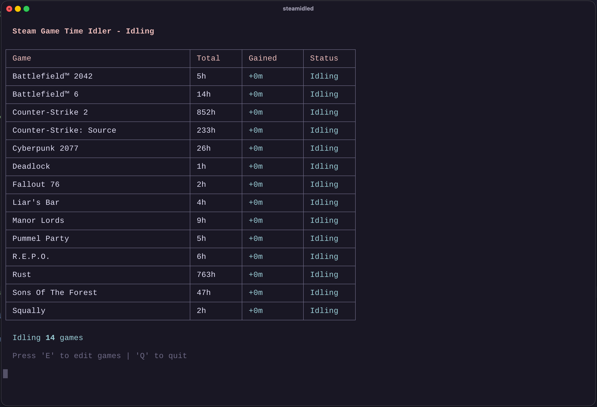
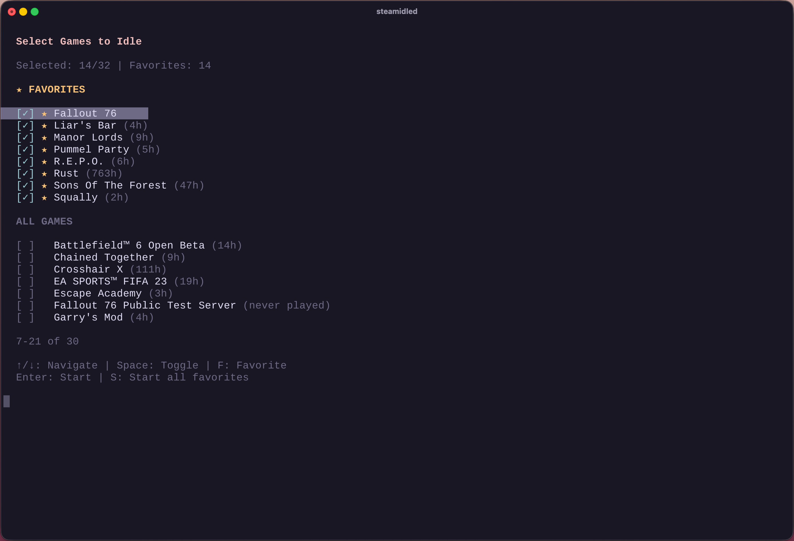

# steamidled 🎮💤

[](https://www.npmjs.com/package/@louisraetz/steamidled)
[](https://www.npmjs.com/package/@louisraetz/steamidled)

Steam game idler CLI and daemon. Rack up playtime while you touch grass. Run up to 32 games simultaneously, collect trading cards, and finally look like you have no life (in a good way).

<p align="center">
  
  
</p>

## ✨ Why does this exist?

This is a hobby project, born from a weekend of vibe coding and questionable life choices. I wanted more hours in games I'll never actually play, and here we are.

Built with love, caffeine, and Claude. No regrets. 🤖☕

## 🚀 Features

- **📱 QR Code Login** — Scan with Steam mobile app
- **🔐 Traditional Login** — Username/password with Steam Guard (for the old school folks)
- **🎯 Idle up to 32 games** — Because Steam said that's the limit and who are we to argue
- **📊 Real-time tracking** — Watch numbers go up. Dopamine achieved.
- **⭐ Favorites system** — Star your favorites so you can pretend you're organized
- **⏸️ Auto-pause** — Automatically pauses when you actually play a game (rare occurrence)
- **💾 Persistent sessions** — Remembers your login so you don't have to

## 📦 Installation

### npm

```bash
npm install -g @louisraetz/steamidled
```

## 🎮 Usage

```bash
steamidled              # Interactive mode
steamidled --headless   # Headless mode (auto-start favorites)
```

### Interactive mode

1. **Pick your login method** — QR code is chef's kiss 👨‍🍳💋
2. **Select your games** — Go wild, pick all of them, I won't judge
3. **Watch the hours roll in** — This is what peak productivity looks like

### Headless mode

Automatically logs in and starts idling your favorited games. Perfect for running as a service. Requires running interactively first to log in and set up favorites.

## ⌨️ Controls

### Game Selection

| Key | What it does |
|-----|--------------|
| `↑` `↓` | Navigate (you got this) |
| `Space` | Toggle game on/off |
| `F` | Favorite a game ⭐ |
| `S` | Start all favorites |
| `Enter` | Let's gooo 🚀 |

### While Idling

| Key | What it does |
|-----|--------------|
| `E` | Edit your selection (changed your mind?) |
| `Q` | Quit gracefully (like a gentleman) |
| `Ctrl+C` | Rage quit |

## 🐧 Running 24/7 on Linux

Want to idle games while you sleep? Same. Run it as a systemd service with `--headless` mode.

### Prerequisites

1. Run the tool interactively once to log in and set up favorites
2. Find where it lives: `which steamidled`

### Create the Service

```bash
sudo nano /etc/systemd/system/steamidled.service
```

```ini
[Unit]
Description=steamidled
After=network-online.target
Wants=network-online.target

[Service]
Type=simple
User=YOUR_USERNAME
ExecStart=/usr/bin/steamidled --headless
Restart=on-failure
RestartSec=10

[Install]
WantedBy=multi-user.target
```

Replace `YOUR_USERNAME` with your username.

### Fire it up

```bash
sudo systemctl daemon-reload
sudo systemctl enable steamidled
sudo systemctl start steamidled
```

### Useful commands

```bash
sudo systemctl status steamidled   # Is it alive?
journalctl -u steamidled -f        # What's it thinking?
sudo systemctl stop steamidled     # Take a break
sudo systemctl restart steamidled  # Turn it off and on again
```

## 📁 Where's my stuff?

Everything lives in `~/.steam-idler/`:

```
~/.steam-idler/
├── credentials.json          # Your login token (keep it secret 🤫)
└── favorites-{username}.json # Your favorite games
```

## 📋 Requirements

- Node.js 18+ (we're modern here)
- A Steam account with games (shocking, I know)
- Steam mobile app (optional, but makes login ✨fancy✨)

## 🤝 Contributing

Found a bug? Have an idea? PRs welcome! This is a hobby project so I might be slow, but I appreciate you. 💙

## ⚠️ Disclaimer

This is just a fun side project. Use responsibly. I'm not responsible if Valve gets mad at you or whatever. Probably don't idle 10,000 hours in a game you've never launched. Or do. I'm not your mom.

## 📄 License

MIT — Do whatever you want with it ✌️

---

*Made with mass vibe coding energy* 🌊✨
